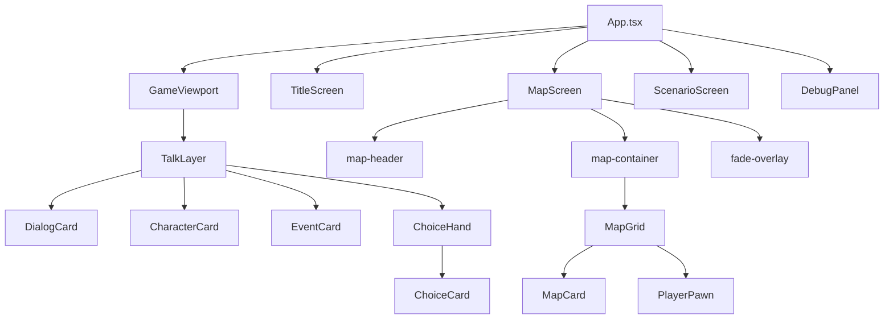

# 画面・コンポーネント構造ガイド

## コンポーネント階層図



---

## 画面一覧

### 1. TitleScreen
**ファイル**: `App.tsx` 内に定義

| セクション | クラス名 | 説明 |
|------------|----------|------|
| コンテナ | `.title-screen` | 1920x1080 背景 |
| タイトル | `h1` | ゲームタイトル |
| ボタン群 | `.title-buttons` | メニューボタン |
| ボタン | `.title-button` | New Game, Continue, etc. |

---

### 2. MapScreen
**ファイル**: `screens/MapScreen.tsx`

| セクション | クラス名/コンポーネント | 説明 |
|------------|-------------------------|------|
| ルート | `.map-screen` | 全画面コンテナ |
| ヘッダー | `.map-header` | マップ名・ステータス表示 |
| タイトル | `.map-title` | 現在マップ名 |
| ヒント | `.map-hint` | 操作方法・Gold・クエスト |
| グリッド | `.map-container` → `MapGrid` | マップタイル群 |
| タイル | `MapCard` | 個別タイルカード |
| プレイヤー | `PlayerPawn` | プレイヤー位置表示 |
| オーバーレイ | `.fade-overlay` | 遷移フェード効果 |

---

### 3. TalkLayer (対話画面)
**ファイル**: `layers/TalkLayer/TalkLayer.tsx`

| セクション | コンポーネント | 説明 |
|------------|----------------|------|
| ダイアログ | `DialogCard` | テキスト表示カード |
| キャラ左 | `CharacterCard` | 左側キャラ |
| キャラ右上 | `CharacterCard` | 右上キャラ |
| イベント | `EventCard` | イベントカード |
| 選択肢 | `ChoiceHand` → `ChoiceCard` | 選択肢群 |

---

### 4. ScenarioScreen
**ファイル**: `screens/ScenarioScreen.tsx`

シナリオ再生用画面（TalkLayerと連携）

---

## ストア一覧

| ストア | ファイル | 役割 |
|--------|----------|------|
| `useMapStore` | `core/stores/useMapStore.ts` | マップ状態・プレイヤー位置 |
| `useTalkStore` | `core/stores/useTalkStore.ts` | 対話表示制御 |
| `useQuestStore` | `core/stores/useQuestStore.ts` | クエスト進行・インベントリ |

---

## MapScreen レイアウト図

```
┌─────────────────────────────────────┐
│           .map-header               │
│  ┌─────────────────────────────┐    │
│  │    .map-title (マップ名)     │    │
│  │    .map-hint (WASD | Gold)   │    │
│  └─────────────────────────────┘    │
│                                     │
│           .map-container            │
│  ┌─────────────────────────────┐    │
│  │         MapGrid             │    │
│  │  ┌────┬────┬────┬────┬────┐ │    │
│  │  │Card│Card│Card│Card│Card│ │    │
│  │  ├────┼────┼────┼────┼────┤ │    │
│  │  │Card│Card│ P  │Card│Card│ │    │
│  │  ├────┼────┼────┼────┼────┤ │    │
│  │  │Card│Card│Card│Card│Card│ │    │
│  │  └────┴────┴────┴────┴────┘ │    │
│  │      PlayerPawn (P)         │    │
│  └─────────────────────────────┘    │
│                                     │
│         .fade-overlay (遷移時)       │
└─────────────────────────────────────┘
```

---

## ファイル一覧

### Screens
- `App.tsx` - エントリポイント、TitleScreen
- `screens/MapScreen.tsx` - マップ画面
- `screens/ScenarioScreen.tsx` - シナリオ画面

### Parts (World)
- `parts/world/MapGrid.tsx` - マップグリッド
- `parts/world/MapCard.tsx` - タイルカード
- `parts/world/PlayerPawn.tsx` - プレイヤー

### Layers (Talk)
- `layers/TalkLayer/TalkLayer.tsx` - 対話レイヤー
- `layers/TalkLayer/DialogCard.tsx` - セリフカード
- `layers/TalkLayer/CharacterCard.tsx` - キャラカード
- `layers/TalkLayer/ChoiceHand.tsx` - 選択肢群
- `layers/TalkLayer/ChoiceCard.tsx` - 選択肢個別
- `layers/TalkLayer/EventCard.tsx` - イベント

### Debug
- `debug/DebugPanel.tsx` - デバッグ用
