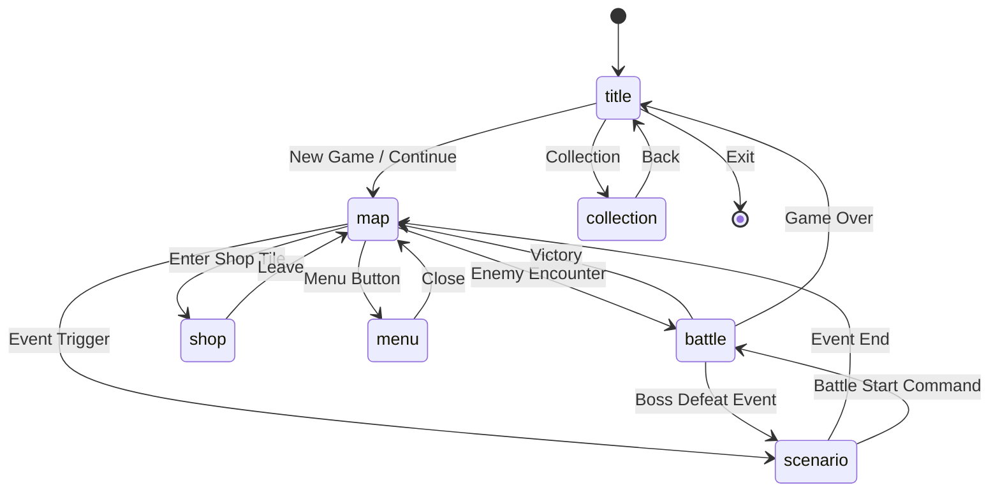

# Screen Flow - 画面遷移設計

## 画面一覧

| Screen ID | 画面名 | 説明 |
|-----------|--------|------|
| `title` | タイトル | ゲーム起動時のメイン画面 |
| `map` | マップ | フィールド探索画面 |
| `battle` | バトル | 戦闘画面 |
| `scenario` | シナリオ | 会話・イベント画面 |
| `menu` | メニュー | パーティ・装備・設定 |
| `shop` | ショップ | 売買画面 |
| `collection` | コレクション | 図鑑・ギャラリー |

---

## 画面遷移図



---

## 各画面の状態

### Title Screen
```
States:
- main_menu: New Game, Continue, Collection, Exit
- save_select: セーブスロット選択
- loading: ロード中
```

### Map Screen
```
States:
- exploring: 移動可能
- event_trigger: イベント発生中
- transitioning: エリア移動中

Context:
- currentMapId: string
- playerPosition: {x, y}
- revealedTiles: Set<string>
```

### Battle Screen
```
States:
- turn_start: ターン開始
- player_action: プレイヤー行動選択
- dice_roll: ダイスロール演出
- enemy_action: 敵行動
- turn_end: ターン終了
- victory: 勝利演出
- defeat: 敗北演出

Context:
- enemies: Enemy[]
- partyStatus: Character[]
- gems: number
- turnCount: number
```

### Scenario Screen
```
States:
- text_display: テキスト表示中
- waiting_input: 入力待ち
- choice_display: 選択肢表示中

Context:
- currentScriptId: string
- currentIndex: number
- displayedCharacters: Character[]
```

---

## Zustand Store 構成

```typescript
// stores/useGameStore.ts
interface GameState {
  currentScreen: ScreenId;
  previousScreen: ScreenId | null;
  
  // Screen-specific contexts
  mapContext: MapContext | null;
  battleContext: BattleContext | null;
  scenarioContext: ScenarioContext | null;
  
  // Actions
  navigateTo: (screen: ScreenId, context?: any) => void;
  goBack: () => void;
}
```

---

## 画面間データ受け渡し

| From | To | 渡すデータ |
|------|-----|-----------|
| map → battle | `encounterId`, `returnPosition` |
| map → scenario | `eventId`, `triggerId` |
| battle → scenario | `victoryEventId` |
| scenario → battle | `battleId` |
| map → shop | `shopId` |
